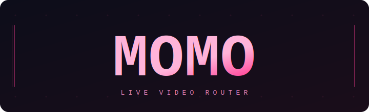

<div align="center">



**Live video splitter/router, written in Rust.**

1 input. N outputs. GPU-accelerated. Zero-copy.

[](https://github.com/yahagi-day/momo/actions/workflows/ci.yml)
[](LICENSE)

[Documentation](#architecture) · [Quick Start](#quick-start) · [API](#api)

</div>

---

## Quick Start

```bash
git clone https://github.com/yahagi-day/momo.git && cd momo
cargo build   # all features enabled by default (DeckLink + UVC + GPU + WebRTC)
cargo run     # => http://localhost:8080
```

Requires CUDA Toolkit and DeckLink SDK headers at build time. Hardware is not required at runtime — features degrade gracefully. Use `cargo build --no-default-features` to build without them.

Frontend (optional — fallback UI is embedded in the binary):

```bash
cd frontend && npm install && npm run build
```

## What is MOMO?

MOMO captures a single video input (DeckLink / UVC / Mock test pattern), applies **per-output GPU transforms** (crop, scale, flip), and routes to **multiple DeckLink outputs** simultaneously — all from a self-contained binary with a built-in web UI.

```
Input (DeckLink/UVC/Mock)
  │
  ▼
GPU Engine ── crop → scale → flip
  │
  ├──▶ DeckLink Output 1
  ├──▶ DeckLink Output 2
  ├──▶ DeckLink Output N
  │
  ├──▶ MJPEG Preview  ──▶  Web UI
  └──▶ WebRTC Preview ──▶  Web UI
```

### Feature Flags

All hardware features are enabled by default. Use `--no-default-features` to disable, or selectively enable:

```
--features decklink    DeckLink capture/output
--features gpu         CUDA processing (GTX 1080+)
--features uvc         UVC camera input
--features webrtc      WebRTC H.264 preview
```

## Architecture

Cargo workspace, 8 crates. Dependency flow is strictly one-directional:

```
momo-core             Shared types (Frame, Config, Error)
  ↑
  ├── momo-decklink   DeckLink FFI via cxx
  ├── momo-uvc        UVC camera input via nokhwa
  ├── momo-gpu        CUDA kernels + CPU fallback
  ├── momo-webrtc     WebRTC preview (str0m + OpenH264)
  │
  ├── momo-pipeline   Frame routing: input → GPU → N outputs
  │     ↑
  │     └── momo-web  axum REST API + WebSocket + preview
  │           ↑
  └───────── momo-app Binary entry point
```

## API

```
GET    /api/status               Pipeline state
POST   /api/pipeline/start       Start pipeline
POST   /api/pipeline/stop        Stop pipeline
GET    /api/config               Current configuration
PUT    /api/config               Apply full configuration
PUT    /api/config/output/:id    Update single output transform
POST   /api/config/save          Persist to JSON file
POST   /api/config/load          Restore from JSON file
GET    /api/devices              Device list
GET    /api/preview/input        Input MJPEG stream
GET    /api/preview/output/:id   Per-output MJPEG stream
WS     /ws/status                State changes, FPS, device events
WS     /ws/preview               WebRTC signaling
```

## Web UI

Embedded into the binary at compile time — no external files needed.

- **Status bar** — pipeline state, FPS, start/stop
- **Input panel** — live MJPEG / WebRTC preview
- **Output cards** — per-output crop/flip with visual overlay editor
- **FPS chart** — real-time visualization
- **Waveform** — video-driven waveform analyzer

## Development

```bash
cargo test                        # 60 tests
cargo clippy -- -D warnings       # lint (CI enforced)
cd frontend && npm run dev        # frontend dev server (proxy to :8080)
```

## Tech Stack

| Layer | Technology |
|---|---|
| Language | Rust |
| DeckLink FFI | cxx |
| GPU | cudarc + nvcc PTX |
| Web | axum |
| Frontend | SolidJS + Vite |
| Preview | MJPEG + WebRTC (str0m, OpenH264) |
| Config | serde_json |

## Platforms

Linux · Windows

## License

See [LICENSE](LICENSE) for details.
